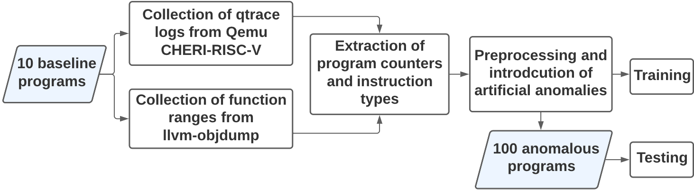
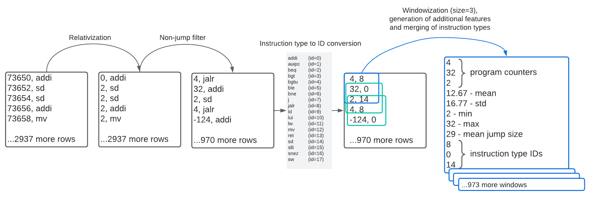
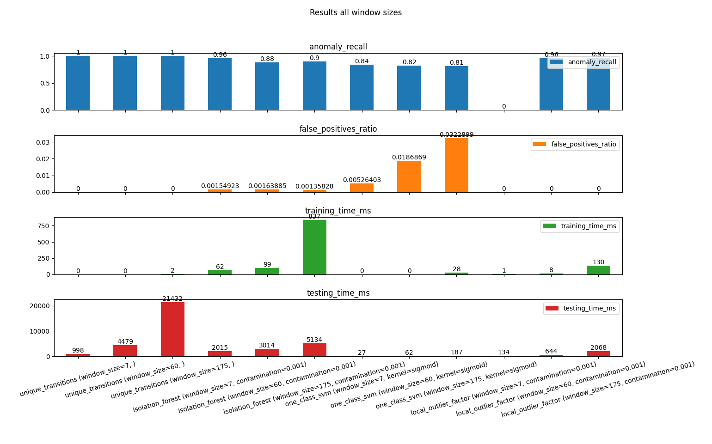

### Purpose
The goal of this project is to compare different methods of anomaly detection in program behaviour.   

### Usage
To run the comparison we can use:  

```bash
python ./scripts/compare_classification_methods.py -n ./log_files/paper/csv/normal*.csv 

# We can include the json file with function ranges if we wish (it does not affect detection methods, it is only supplied for plotting purposes)
python ./scripts/compare_classification_methods.py -n ./log_files/paper/csv/normal*.csv --function-ranges ./log_files/paper/*json
```

### Input format
Input csv files with baseline program data have two columns: program counters (in hexadecimal) and instruction types (strings). Example input file:
```csv
11FB2,addi
11FB4,sd
11FB6,sd
11FB8,addi
11FBA,mv
11FBC,sd
11FC0,sw
11FC4,auipc
11FC8,jalr
...
```

Abnormal files are generated artificially by copying normal input files and modifying random sections (one section per file).   

### Obtaining input files
Input files may be obtained in various ways (e.g. running GDB). Input files from [./log\_files/paper/csv](./log_files/paper/csv) directory were obtained from Qemu emulator running CHERI-RISC-V, using `qtrace -u exec ./stack-mission` and then processing the collected trace log file (e.g. normal\_1.log) by running the following commands:  

```bash
# Obtaining output of llvm-objdump of the stack-mission program.
/tools/RISC-V/emulator/cheri/output/sdk/bin/llvm-objdump -sSD stack-mission > stack-mission-llvm-objdump.txt

# Extracting function ranges from the ".text" section of llvm-objdump output and storing it in json file.
./extract_function_ranges_from_llvm_objdump.py stack-mission-llvm-objdump.txt -o stack-mission-function-ranges.json

# Parsing the trace log using function ranges (to avoid any trace other than from the program itself, e.g. ignoring library code)
./parse_qtrace_log normal_1.log --function-ranges stack-mission-function-ranges.json -o normal_1.csv
```

  


### Preprocessing done by the comparison program

  


### Example results

  
