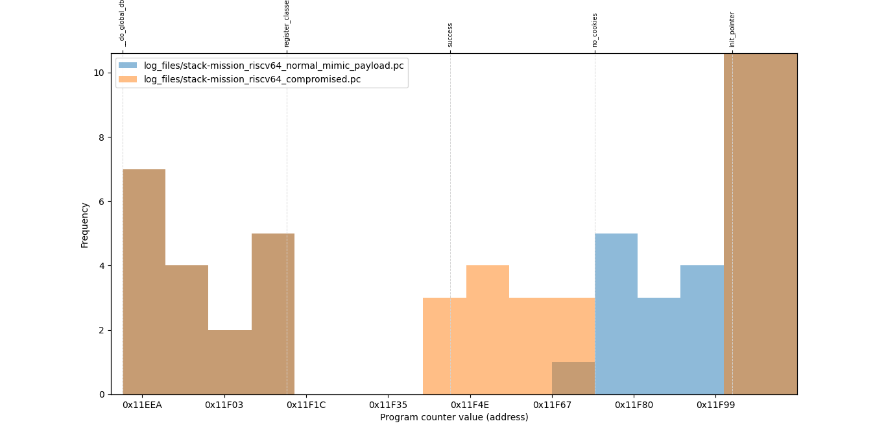
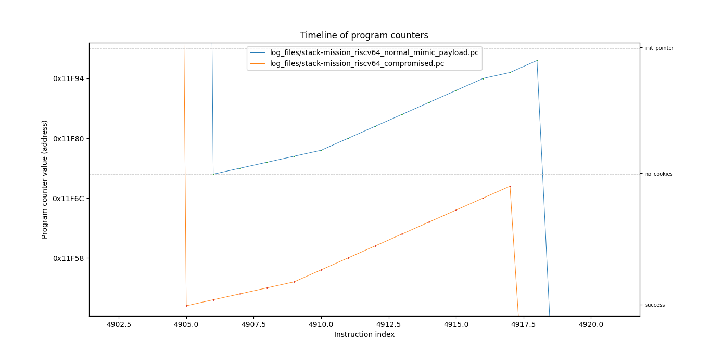
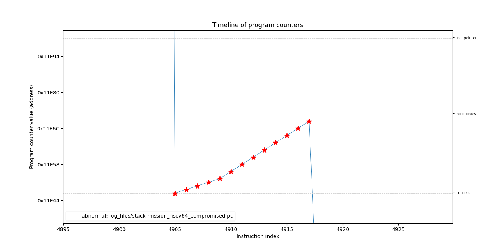

**stack-mission_riscv64_normal_mimic_payload.pc** file contains normal/baseline program counter values.  

**stack-mission_riscv64_compromised.pc** contains some abnormal values (index range of abnormal program counter values is: 4905 - 4917).  

Both were produced by running the "[uninitialized stack frame to manipulate control flow](https://ctsrd-cheri.github.io/cheri-exercises/missions/uninitialized-stack-frame-control-flow/index.html)" CHERI mission on Qemu emulator.  
The 4905-4917 index range of values from compromised file is where the "success" function was executed (thanks to maliciously crafted input).  

We can compare contents of both files by running:  
```bash
./scripts/compare_program_counters.py log_files/stack-mission_riscv64_normal_mimic_payload.pc log_files/stack-mission_riscv64_compromised.pc --function-ranges log_files/stack-mission_riscv64_llvm_objdump_ranges.json
```  

    
    

So far only the "unique transitions" detection method is implemented. We can see its results by running:  
```bash
./scripts/compare_classification_methods.py --normal-pc log_files/stack-mission_riscv64_normal_mimic_payload.pc --abnormal-pc log_files/stack-mission_riscv64_compromised.pc  --function-ranges log_files/stack-mission_riscv64_llvm_objdump_ranges.json
```  

    

### Prerequisites
python3 with pandas, numpy, matplotlib


